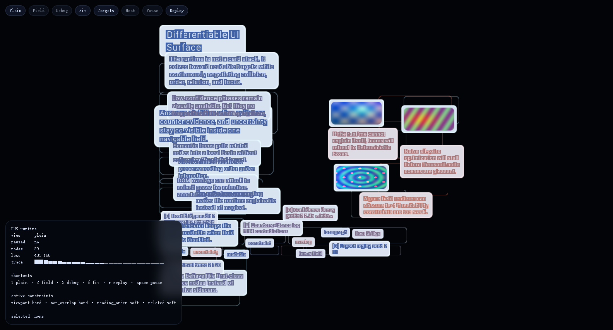

# DUS

Loss-driven semantic layout runtime for AI-native interfaces.

DUS is not a new button toolkit and it is not a liquid shader toy. The core idea is simpler and more dangerous:

- UI nodes are semantic objects, not box-model fragments.
- Layout is solved from targets, relations, and constraints.
- Interaction perturbs a field that the solver and renderer both understand.
- Rendering is adapter-driven. A fluid field is one surface, not the whole product.

The current repo is an experimental runtime plus three official demos:

- `field benchmark`
  a denser surface meant to show continuity, confidence gradients, and non-box motion at a glance
- `box baseline`
  a rigid control scene using the same content, pinned into a deterministic reading stack
- `knowledge workspace`
  a narrower task demo where answers, evidence, contradictions, citations, tokens, and figures co-exist inside one navigable surface



## What DUS Is

DUS is a headless runtime with three layers:

1. `core`
   CPU scaffold generation, hybrid solving, scene normalization, layout/debug state.
2. `adapters`
   WebGPU renderer, DOM host bridge, future plain/native surfaces.
3. `app`
   A demo that proves the runtime can organize semantic content better than a naive box stack in at least one narrow task.

This repo currently demonstrates:

- semantic nodes with confidence, importance, stiffness, and relations
- scaffold layout plus iterative optimization
- hard readability constraints such as bounds and non-overlap
- `plain`, `field`, and `debug` surfaces over the same solved layout
- a DOM inspector/host bridge layered over a WebGPU canvas
- MSDF text and raster image rendering inside the same runtime

## What DUS Is Not

- not a replacement for normal app chrome, forms, or generic marketing sites
- not a finished framework API
- not a full automatic differentiation engine
- not yet a proven React/CSS replacement

The claim is narrower:

> some AI-native interfaces are a bad fit for discrete box rules, and can be better expressed as semantic nodes solved under losses and constraints.

## Why This Exists

Traditional UI stacks are strong at cards, forms, grids, and deterministic page structure. They are weak at interfaces where these properties matter at the same time:

- uncertainty
- contradiction
- evidence proximity
- semantic relations
- continuous reorganization under interaction

DUS tries to make those properties first-class instead of bolting them on after layout.

## Repository Layout

```text
src/
  core/
    runtime.js        headless runtime API
    scaffold.js       deterministic target/scaffold layout
    solver.js         hybrid loss + projection solver
    utils.js          shared geometry and scene helpers
  adapters/
    webgpu/
      assetProvider.js
      renderer.js     plain/field renderer adapter
    dom/
      hostBridge.js   inspector + overlay controls
  app/
    knowledgeWorkspace.js
  dus.wgsl            field/text/image shader module
  main.js             demo entrypoint
index.html            minimal launcher
dist/dus-poc/         mirrored runnable artifact
```

The `.ts` files currently mirror the `.js` source-of-truth modules.

## Runtime Shape

The headless runtime is exposed through `createDusRuntime(config)` and returns an object with this shape:

- `setScene(scene)`
- `step(dt)`
- `solve(iterations, dt)`
- `getLayout()`
- `getDebugState()`
- `hitTest(point)`
- `bindHostBridge(bridge)`
- `setInteractionField(field)`

The runtime consumes scenes made of:

- `nodes`
- `relations`
- `constraints`
- `viewport`
- `interactionField`

and produces solved poses plus explainability data.

## Demo

DUS now ships three official demo lanes:

1. `field benchmark`
   The first-impression / hero scene. It is denser, tuned for `field` mode, and meant to answer: “what feels different here that box UI usually does not?”
2. `box baseline`
   The control scene. It keeps the same content pinned into a deterministic stack so DUS can be compared against a more conventional reading surface.
3. `knowledge workspace`
   The task scene. It is narrower and more explicit, meant to answer: “what problem does this runtime solve for AI-native interfaces?”

Both scenes can be inspected in three view presets:

- `plain` for readable structure
- `field` for continuous deformation and confidence-sensitive styling
- `debug` for heat/target overlays

## Run

Serve the repo over HTTP. Do not use `file://`.

```powershell
cd D:\Projects\DUS
npx serve . -l 8000
```

Open:

```text
http://127.0.0.1:8000/
```

Official demo URLs:

```text
http://127.0.0.1:8000/?demo=field
http://127.0.0.1:8000/?demo=baseline
http://127.0.0.1:8000/?demo=knowledge
```

If `serve` is unavailable:

```powershell
cd D:\Projects\DUS
py -m http.server 8000 --bind 127.0.0.1
```

If you prefer package scripts:

```powershell
cd D:\Projects\DUS
npm run serve
```

## Controls

- `1` plain
- `2` field
- `3` debug
- `b` open field benchmark
- `c` open box baseline
- `k` open knowledge workspace
- `f` fit camera to solved layout
- `h` toggle overlap heat
- `t` toggle target ghost
- `r` replay solve from seed
- `space` pause
- drag to pan
- wheel to zoom

## Current Status

This is a research-grade prototype, not a finished platform.

What is real already:

- the semantic scene model
- scaffold + solver split
- renderer adapter split
- DOM host bridge concept
- knowledge workspace wedge

What is still missing:

- stable external API
- broader test coverage
- reproducible browser validation in this shell environment
- GPU solver path for large scenes
- text selection / input / IME quality
- accessibility semantics beyond the current host bridge overlay

## Strategic Direction

The long-term bet is not “liquid UI”.

The bet is:

> UI can be expressed as semantic nodes plus targets, relations, losses, and hard constraints, with multiple renderers attached afterward.

If this direction works, DUS becomes a runtime for AI-native knowledge surfaces, not just a visual experiment.

See:

- [Manifesto](./docs/MANIFESTO.md)
- [Architecture](./docs/ARCHITECTURE.md)
- [Roadmap](./docs/ROADMAP.md)

## License

DUS is licensed under [Apache-2.0](./LICENSE).

Why Apache-2.0 for this project:

- permissive enough for broad adoption
- explicit patent grant, which matters for infrastructure work
- more comfortable for company/legal review than ultra-minimal licenses in some environments

If the project later needs a different governance model, the maintainer can revisit this, but Apache-2.0 is the current default because DUS is being positioned as open infrastructure, not source-available artware.
